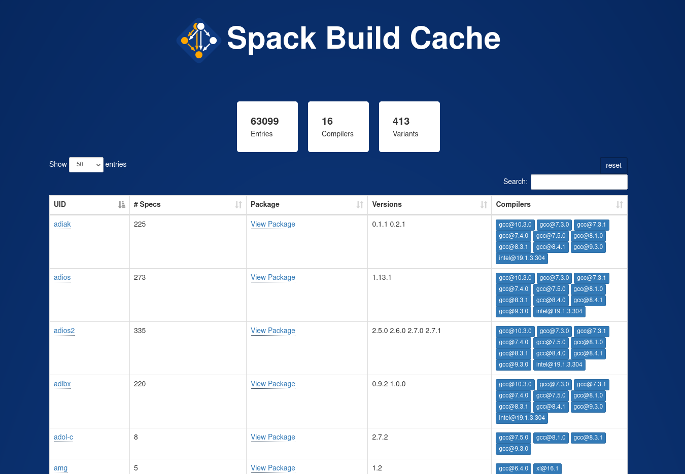

# Spack Build Cache

> What is currently in the build cache?

This small interface provides a summary table that shows versions, compilers,
total specs, and allows for basic search!



When you dig into a particular build cache package, you'll
be presented with another view to inspect specs in detail, or search.


⭐️ [See the Build Cache!](https://cache.spack.io/) ⭐️

## Usage

You'll need a few dependencies:

```bash
$ pip install -r requirements.txt
```

If you need to update remotes, meaning named urls for different versions, see [_data/tags.yaml](_data/tags.yaml).
For each new name you add, since we need to filter a page to it, you should also add the same named
page under [pages/tags/](pages/tags) to render just that specific version. The page [pages/cache.md](cache.md)
will show all of them. You should then run the generate script with spack, which means that it needs to be on your path.

```bash
$ spack python generate_cache.py
```

This will generate a folder for each package in the cache under [_cache](_cache), each
with a top level metadata file and a list of full specs. The specs are loaded on
demand.

```bash
$ tree _cache/cub
_cache/cub
├── spec-0.json
├── spec-10.json
├── spec-11.json
├── spec-1.json
├── spec-2.json
├── spec-3.json
├── spec-4.json
├── spec-5.json
├── spec-6.json
├── spec-7.json
├── spec-8.json
├── spec-9.json
└── specs.md

0 directories, 13 files
```

To view the interface locally, use jekyll:

```bash
$ bundle exec jekyll serve
```

The above would open to [http://localhost:4000/cache/](http://localhost:4000/).
You can then browse the cache.

## Find an Issue?

If you find a bug or want to contribute to the interface please [let us know!](https://github.com/spack/cache.spack.io/issues).
